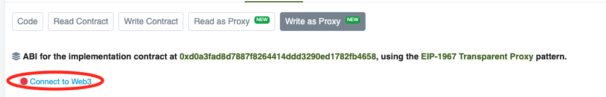

# Bridge G$

Currently there's no UI for bridging to/from Celo, this guide will explain how you can bridge using blockchain explorers and metamask.

### Fuse Bridge

Fuse runs a bridge that enables bridging between Ethereum and Fuse. It has an easy to use UI here: [https://app.voltage.finance/#/bridge](https://app.voltage.finance/#/bridge)

### Bridging Instructions


In celoscan and etherscan make sure you press `connect to web3` button


<figure><figcaption>
Conect to Web3 Button
</figcaption></figure>


The current maximum amount you can bridge is 300M G$s.\
If you plan to bridge amounts in that order it is recommended you first verify that your request is within limits. See the Verifying bridge limits section.


1. **Approve the bridge to spend G$ tokens**
   1. Go to the G$ Contract page on the chain you are bridging from
      * Fuse: [https://explorer.fuse.io/address/0x495d133B938596C9984d462F007B676bDc57eCEC/write-contract#address-tabs](https://explorer.fuse.io/address/0x495d133B938596C9984d462F007B676bDc57eCEC/write-contract#address-tabs)
      * Celo: [https://celoscan.io/address/0x62b8b11039fcfe5ab0c56e502b1c372a3d2a9c7a#writeProxyContract](https://celoscan.io/address/0x62b8b11039fcfe5ab0c56e502b1c372a3d2a9c7a#writeProxyContract)
      * Ethereum: [https://etherscan.io/address/0x67C5870b4A41D4Ebef24d2456547A03F1f3e094B#writeContract](https://etherscan.io/address/0x67C5870b4A41D4Ebef24d2456547A03F1f3e094B#writeContract)
   2. Open the `approve` method box and enter in the `spender` box the bridge address `0xa3247276dbcc76dd7705273f766eb3e8a5ecf4a5` (same on all chains) and in the `value/amount` enter the number of G$ units you want to bridge.\
      **Notice: In Fuse/Ethereum the units are in 2 decimals meaning that if you want to bridge 1.15 tokens this is equal to 115 units. On Celo the units are in 18 decimals, so 1.15 is 1150000000000000000 units.**\
      Press the \`write\` button and approve the transaction in your wallet.
2. **Find out the estimated bridge fee by going to** [https://goodserver.gooddollar.org/bridge/estimatefees\
   ](https://goodserver.gooddollar.org/bridge/estimatefees)Record the amount for the service and path you are bridging, for example if you are bridging from Ethereum to Celo using Axelar then use the value under `AXL_ETH_TO_CELO` if using LayerZero then use the value under `LZ_ETH_TO_CELO`\
   **At the moment Axelar service is usually cheaper.**\
   **Bridging from/to Fuse is only supported by LayerZero.**
3. **Issue bridge request**
   1. Go to the Bridge Contract page on the chain you are bridging from
      * Fuse: [https://explorer.fuse.io/address/0xa3247276DbCC76Dd7705273f766eB3E8a5ecF4a5/write-proxy#address-tabs](https://explorer.fuse.io/address/0xa3247276DbCC76Dd7705273f766eB3E8a5ecF4a5/write-proxy#address-tabs)
      * Celo: [https://celoscan.io/address/0xa3247276dbcc76dd7705273f766eb3e8a5ecf4a5#writeProxyContract](https://celoscan.io/address/0xa3247276dbcc76dd7705273f766eb3e8a5ecf4a5#writeProxyContract)
      * Ethereum: [https://etherscan.io/address/0xa3247276dbcc76dd7705273f766eb3e8a5ecf4a5#writeProxyContract](https://etherscan.io/address/0xa3247276dbcc76dd7705273f766eb3e8a5ecf4a5#writeProxyContract)
   2. Open/Scroll to the bridgeTo method box and enter in `target` the wallet address of the recipient, in `targetChainId` enter the chain id you are bridging to (1-Ethereum 122-Fuse 42220-Celo), in `amount` enter the same value as used in step #1 (the approve step), in `bridge` enter 0 for Axelar and 1 for LayzerZero. Lastly in `value/payableAmount` enter the estimated bridge fee from step #2.\
      **Make sure you have at least that amount of native tokens in your wallet**\
      press the \`write\` button


When bridging from ethereum it can take 15 minutes for the transfer to be executed.


###

### Verifying bridge limits

The bridge enforces some transfer limits for security. To make sure your request will go smoothly it is recommended to first check on the **target** chain that your request is within limits.

1. Go to the Bridge Contract page on the chain you are **bridging to**
   * Fuse: [https://explorer.fuse.io/address/0xa3247276DbCC76Dd7705273f766eB3E8a5ecF4a5/read-proxy#address-tabs](https://explorer.fuse.io/address/0xa3247276DbCC76Dd7705273f766eB3E8a5ecF4a5/read-proxy#address-tabs)
   * Celo: [https://celoscan.io/address/0xa3247276dbcc76dd7705273f766eb3e8a5ecf4a5#readProxyContract](https://celoscan.io/address/0xa3247276dbcc76dd7705273f766eb3e8a5ecf4a5#readProxyContract)
   * Ethereum: [https://etherscan.io/address/0xa3247276dbcc76dd7705273f766eb3e8a5ecf4a5#readProxyContract](https://etherscan.io/address/0xa3247276dbcc76dd7705273f766eb3e8a5ecf4a5#readProxyContract)
2. Open/Scroll to the `canBridge` method and enter in `from` the wallet address where you are bridging from and in `amount` enter the amount of **units in 18 decimals** that you want to bridge then press the `Query` button.

### Troubleshooting

* You can see the status of your bridge request by copying the bridge request transaction hash from step #3 and pasting it in Axelar or Layerzero scanners according to the service you used.\
  Axelar Scanner: [https://axelarscan.io/](https://axelarscan.io/)\
  Layzerzero Scanner: [https://layerzeroscan.com/](https://layerzeroscan.com/)
* If the transaction did not reach the final step on Axelar or Layerzero consult with their documentation or support channels.\
  [https://docs.axelar.dev/dev/general-message-passing/recovery](https://docs.axelar.dev/dev/general-message-passing/recovery)
* In case the transaction has been executed by Axelar or Layzezero but still failed to transfer the G$s then contact us via our support form here:


