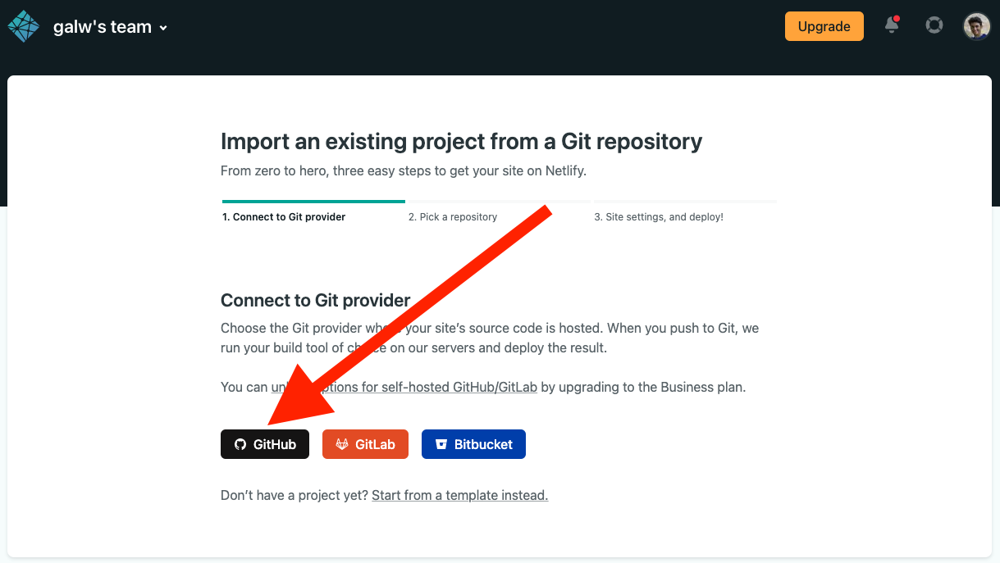
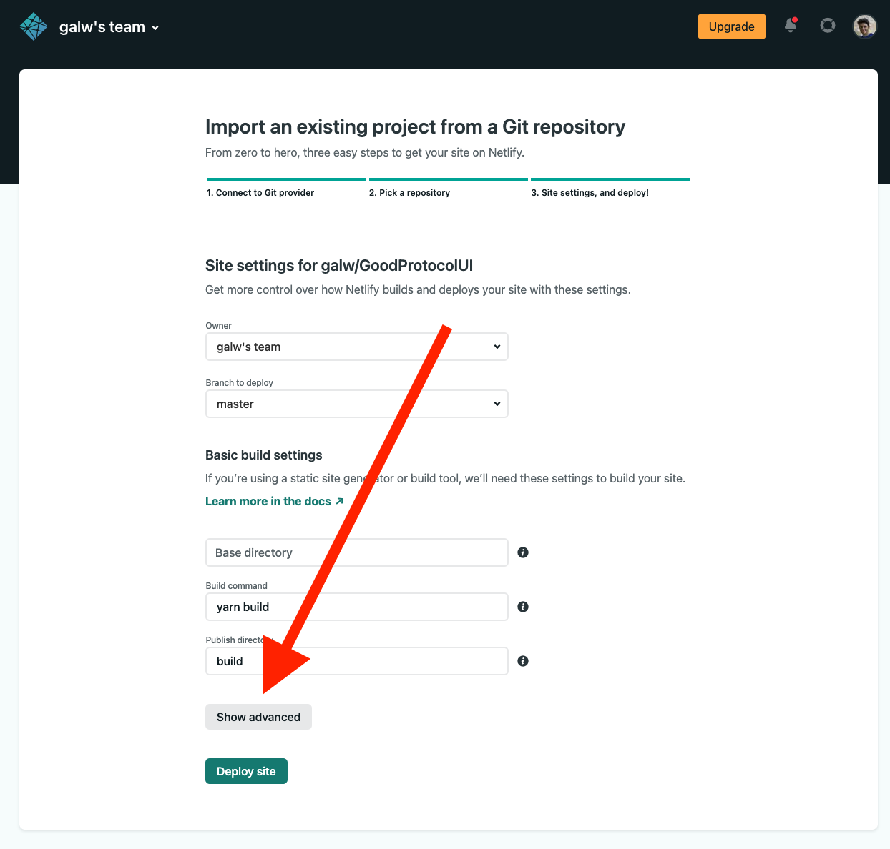
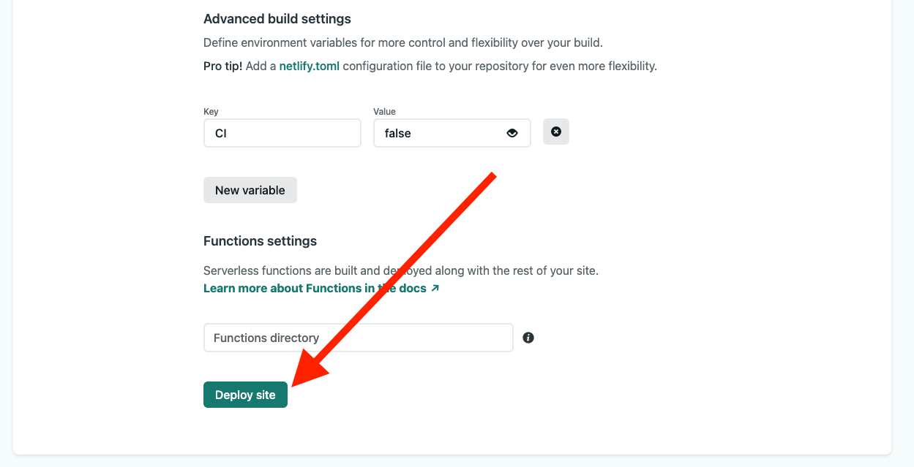
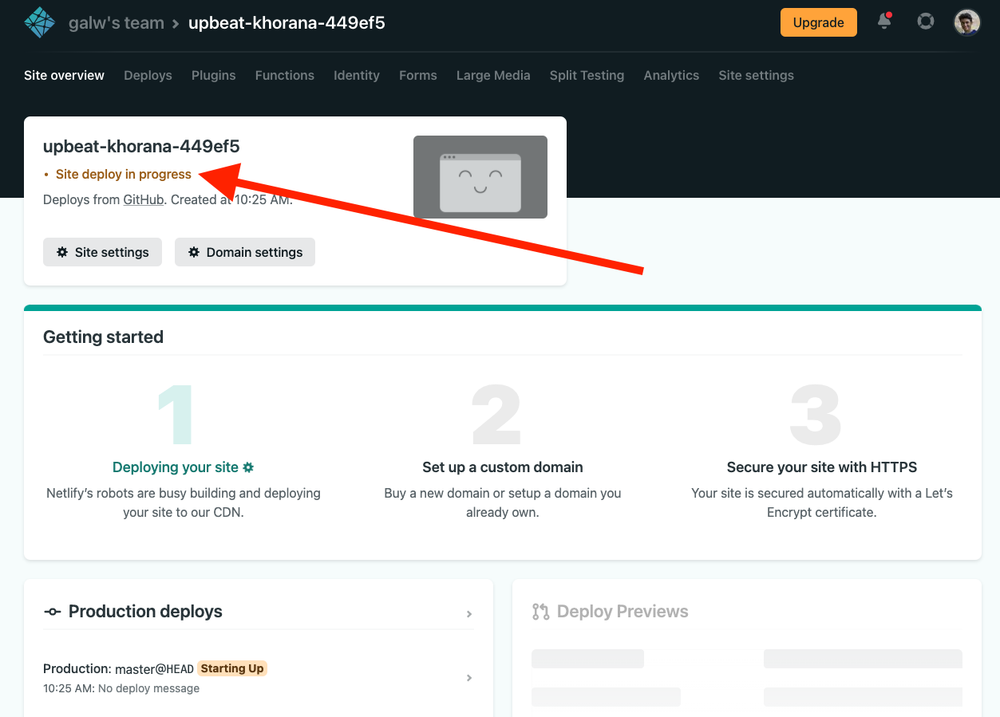
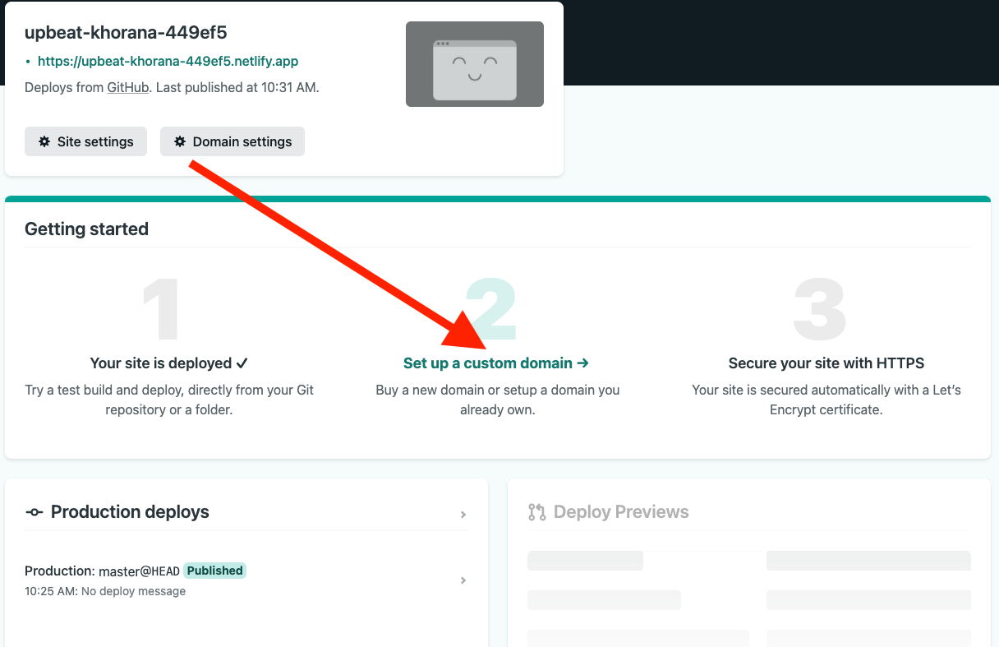

# Deploy your own GoodDapp UI

GoodDollar currently is not running its own frontend — making the system more decentralized and censorship-resistant. 

Besides choosing to interact with the GoodDollar contract with Etherscan as facilitated in the previous User Guides, users can also choose to deploy their own Gooddollar Protocol V2 User Interface (UI) by forking the ProtocolUI code from the Open-Sourced [GoodDollar Github repository](https://github.com/GoodDollar) in the case they can't make use of any Community Deployed front-end.

### Deploy your own GoodDollar UI Tutorial

#### This will be done by a few simple steps based on the open-source repository you can find [here](https://github.com/GoodDollar/GoodProtocolUI).

This tutorial will show you how to deploy it using Netlify, but you can use Vercel, Heroku, or other services.

1. Go to the [GoodProtocolUI repository on Github](https://github.com/GoodDollar/GoodProtocolUI) and fork it to your Github account.
2. Clone it locally and install the dependencies by running the command 'yarn' on your terminal.
3. Run the 'yarn start' command in your terminal in order to run it locally on your machine.
4. Make any changes relevant for you and push them to your repository on Github.
5. Go to [Netlify](https://www.netlify.com/) and log in using your Github account.
6. Go to your [Netlify app](https://app.netlify.com/) and click on "New site from Git":                                                       
7. Select Github:                                                                                                                                                                                     
8. Choose the \<your\_github\_username>/GoodProtocolUI
9. Click on Show advanced button:                                                                                                                                                     
10. Add a new variable with this key-value pair:                                                                                                                                         .png>)
11. Deploy your site:                                                                                                                                                                               &#x20;
12. It will take a few minutes, you could see the progress here:                                                        
13. After it's finished your site is basically on air and is accessible through the address shown at the top of the page, you could connect your own domain by clicking here:                                                        &#x20;
14. Every change you will make and push to your 'master' branch on your forked repo will automatically be deployed to your website.

.png>)

### Community Deployed GoodDollar UI 

* [goodswap.xyz](https://goodswap.xyz/)
