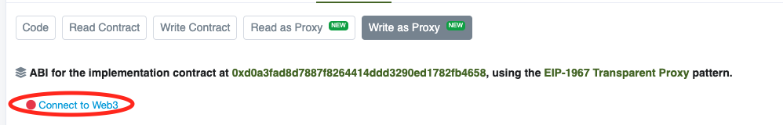

# Developer Guides

We are using [Fontello](http://fontello.com/) to generate the font from svg icons.

1. We need to create a new project if we already did that, upload existing icons on **Select icons** tab.

1. We select the icons we want to add to the font, and in the second tab we can change icon names.

1. Once we renamed the icons, we can see the codes, and we can update some of them if it's necessary...in most of the cases we can leave the code as they are.

1. Before downloading the font, we can define the name, and the default font size at the top bar.

Because we are going to update an already created font, we should import the config.json file, and we can do that from the tool button, and choosing **Import** menu item.

**config.json** file is in GoodDAPP project, inside src/components/common/view/Icon folder.

We can also add icons from other fonts that are available on the main page of Fontello.
